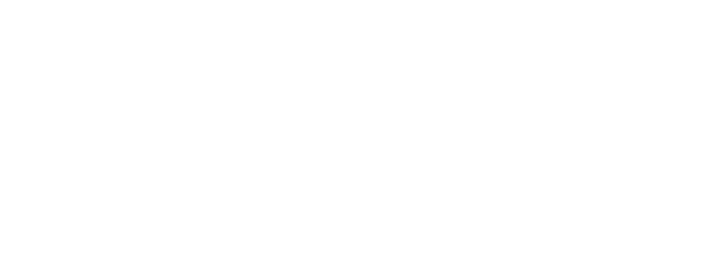

# MHDECS



## MHDECS - Simple cross-platform header-only C++ Entity Component System

## Brief description of objects:

### Component

The main structure from which all components should be inherited

Example:
```cpp
  struct MyComponent : public MHDECS::Component {
    float a, b, c;
    bool d, e, f;
    ...
  }

```

### IEntity

The class-interface from which all entities should be inherited. It can also be used without inheritance.

Example with inheritance:
```cpp
  class MyEntity : public MyBaseClass, public IEntity, ... {
      ...
  }

  auto entity = MHDECS::Registry::registerEntity(new MyEntity(...));
```

Example without inheritance:
```cpp
  auto entity = MHDECS::Registry::registerEntity(new IEntity());
```

You can manipulate with components:

```cpp
  entity->AddComponent<MyComponent>(); // Add component to the entity. Each component can only be added once. Returns reference to the created component.
  entity->GetComponent<MyComponent>(); // Returns pointer to specified component if exists, otherwise nullptr
  entity->HasComponent<MyComponent>(); // Returns bool - does the entity has component
  entity->RemoveComponent<MyComponent>(); // Removes component and frees memory
```

